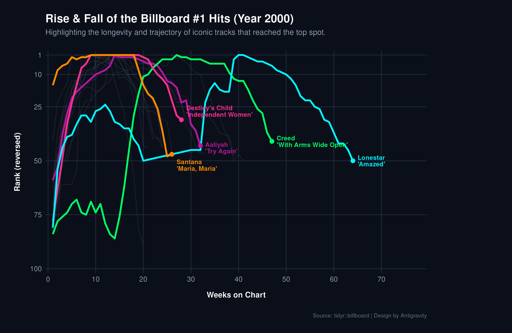

```{r}
suppressPackageStartupMessages(library(tidyverse))
library(knitr)
```

The `billboard` dataset from the `tidyr` package tracks the weekly rank of songs that entered the Billboard Hot 100 in the year 2000. Below, we visualize the trajectory of the 17 songs that successfully reached the #1 spot, highlighting a few of the most long-lasting and memorable hits of that year.

```{r}

```


